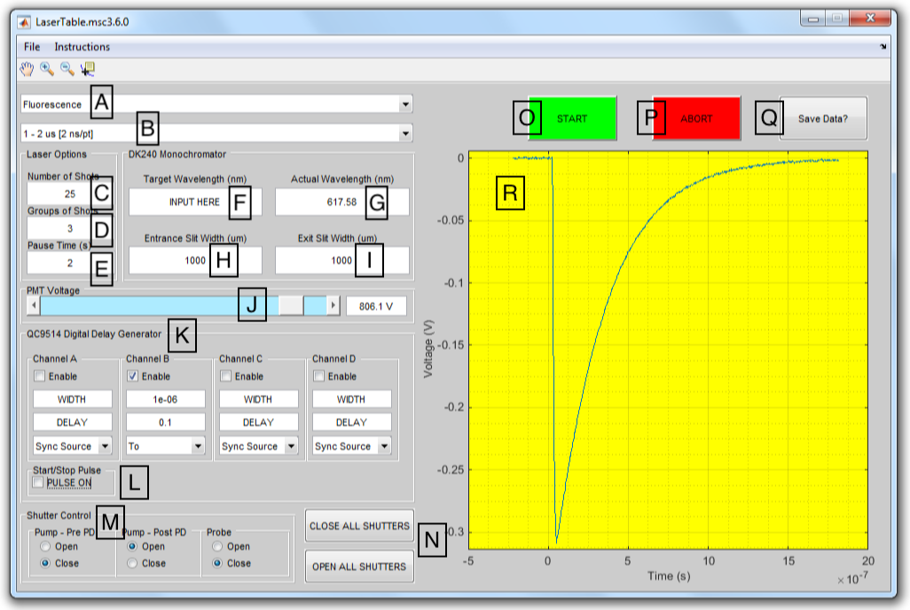
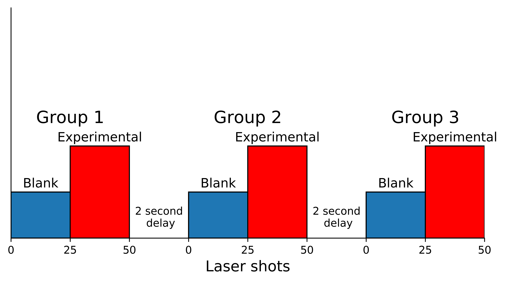

# WarrenLabLaserSoftware
Repository containing all Warren Lab MATLAB laser code written by David Weber. See [Applications of numerical linear algebra to protein structural analysis: the case of methionine-aromatic motifs](https://summit.sfu.ca/item/18741) for more information.

## Table of contents
- [Disclaimer](#disclaimer)
- [Layout](#layout)
- [Description](#description)
- [Example for Laser Options parameters](#example-for-laser-options-parameters)
- [Description of all directories](#description-of-all-directories)

## Disclaimer
- _I am not a MATLAB expert_. Actually I learned MATLAB on the fly simply to fulfill the requirements of this project. **I acknowledge that this code is far from ideal** and I would have done many things differently now that I am more experienced.
- Some of this code was automatically generated using the MATLAB GUI editor.
- This code can likely very easily (and should) be broken up into individual `*.m` files.

## Layout

    

## Description
Label | Description
----- | -----------
**A** |  Here the user chooses between fluorescence and TA mode.
**B** |  The user selects a timebase (i.e. time interval to sample starting from oscilloscope trigger).
**C** |  The number of blank and experimental laser flashes (see [Example for Laser Options parameters](#example-for-laser-options-parameters)).
**D** |  The number of groups of laser flashes (see [Example for Laser Options parameters](#example-for-laser-options-parameters)).
**E** |  The pause time between groups of shots (see [Example for Laser Options parameters](#example-for-laser-options-parameters)).
**F** |  The user selects the DK240 monochromator wavelength (sent as an SCPI command TO the DK240).
**G** |  The DK240 returns the ACTUAL wavelength back to the user.
**H** |  The user selects the slit width at the entrance of the DK240.
**I** |  The user selects the slit width at the exit of the DK240.
**J** |  The user selects the Hamamatsu PMT voltage.
**K** |  QC9514 Digital Delay Generator options. Note that these fields are filled automatically upon toggling **A**.
**L** |  This checkbox fires up the laser. The laser will not fire until all parameters have been selected.
**M** |  Convenience feature for programmatically controlling individual shutters.
**N** |  Convenience feature for programmatically controlling all shutters.
**O** |  Pressing the START button will begin an experiment.
**P** |  Pressing the ABORT button will immediately stop an experiment. **Use in case of a major safety issue arising during an experiment** or perhaps to abort an experiment if parameters were incorrectly chosen.
**Q** |  Exports signal averaged data as .csv to a directory of choosing.
**R** |  The results pane displaying the oscilloscope output.

## Example for Laser Options parameters
Note that in the [Layout](#layout) example, the "user" has indicated they wish to collect 3 groups of 25 shots and have inputted a delay time of 2 seconds. What does this mean? An oscilloscope reading the output of the PMT will first collect 25 reads with a shutter blocking the Nd:YAG laser from striking the sample cuvette. This is the blank read. The shutter will then open and the Nd:YAG laser will reach (and excite) the sample 25 times. The sample will emit light which will be picked up by the PMT/oscilloscope. The blank data will then be subtracted from the experimental data to yield corrected data. Corrected data will then be signal averaged. Recall that the user specified 3 groups of shots. The aforementioned sequence of events will now be repeated three times, with a delay of 2 seconds between each group. The figure below very nicely depicts this sequence of events:

    

## Description of all directories
File / Directory | Description
---------------- | -----------
`LaserTableProgram3_10_0.fig` | Last grad school GUI update. This is a binary file generated by MATLAB
`LaserTableProgram3_10_0.m` | Last grad school "main" script update
`LaserTableProgram.fig` | The GUI code. This is a binary file generated by MATLAB
`LaserTableProgram.m` | The "main" script
`css.m` | Isolated `.m` CompuScope data acquisition script
`l_ts.m` | Isolated `.m` long timescale data acquisition script
`docs` | Contains all hardware data/spec sheets
`icon.png` | Some throwaway icon for standalone shortcut
`caliper.ico` | Some throwaway icon for standalone shortcut
`gui_3.6.0.png` | Screenshot of v3.6 UI for documentation/thesis purposes
`gui_3_10_withlabels.png` | Screenshot of v3.10 UI for documentation purposes
`general_instructions.txt` | Basic instructions imported into program upon user request
`additional_features.m` | Info for other features that can be requested by user
`groups_shots_pause.m` | Schematic representation of groups vs. shots vs. pause UI input
